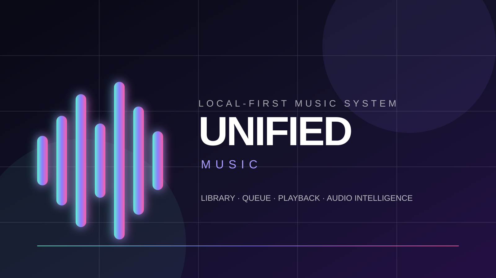
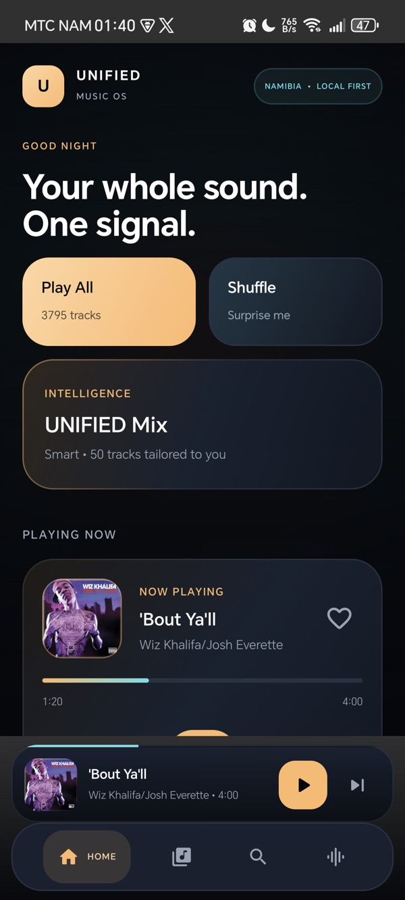
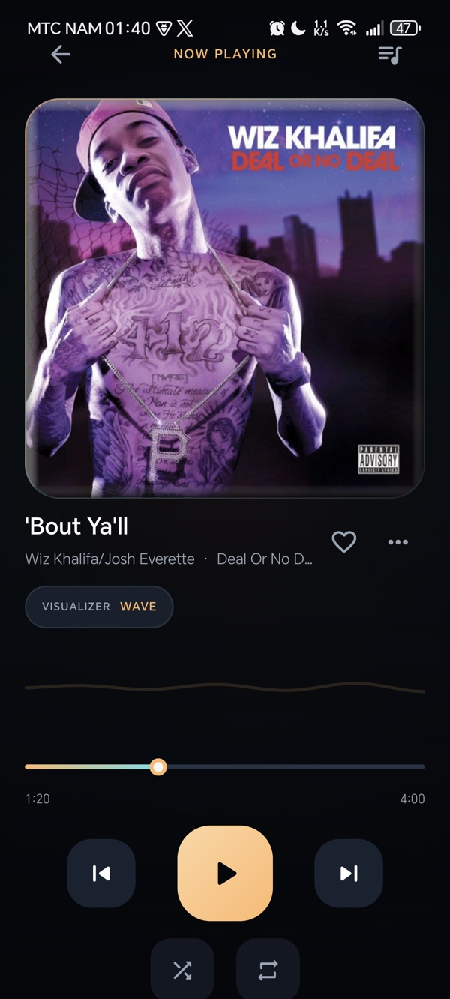
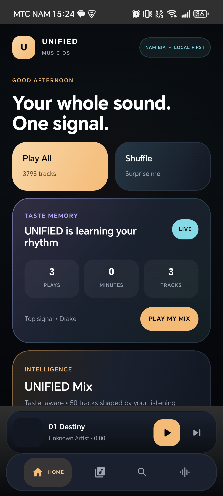
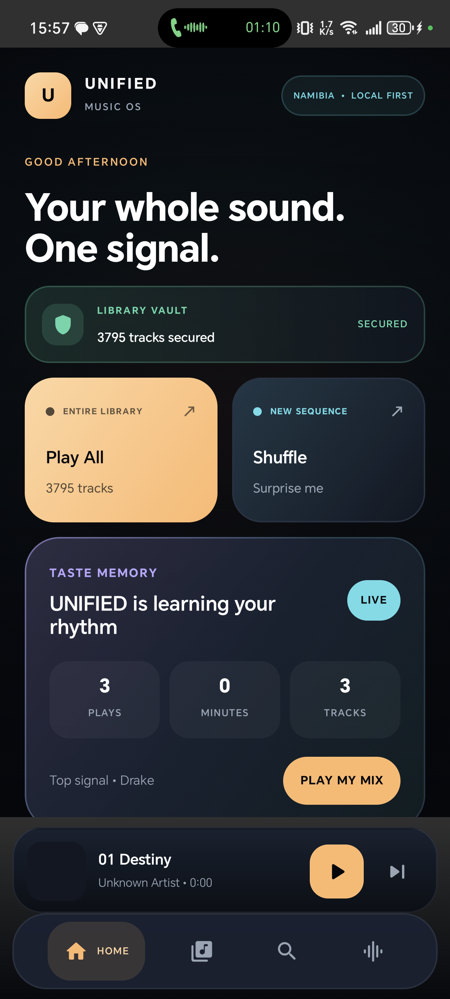

# UNIFIED Music — Kotlin Multiplatform Case Study



**A local-first music system designed and engineered in Namibia—one coherent library, queue, player and audio-control experience.**

> This is a public product and engineering case study. Deployable source, device configuration, local media, build artefacts, credentials and private implementation details remain in a separate private repository.

## UNIFIED 3.0 — Namib After Dark

The 3.0 visual system moves away from generic neon glass toward a more ownable identity: obsidian night, warm dune light, Atlantic-blue information accents and restrained orchid highlights. Artwork remains the emotional centre while glass is limited to navigation and transient playback surfaces.

| Home | Now Playing |
| --- | --- |
|  |  |

These screens were captured from the installed `3.0-debug` build on a physical Android 15 device.

## UNIFIED 4.0 — Taste Memory

Version 4.0 turns the dormant recommendation foundation into a local-first listening intelligence system. It records credible starts, early skips and listened time on-device, restores that history across launches, and makes the result visible through a new Taste Memory dashboard plus Recently Played and Most Played shelves.

UNIFIED Mix now adapts from favourite, artist, album and recency signals. The system remains explainable and private: no listening history leaves the device, and provider integrations stay behind explicit capability boundaries.

## UNIFIED 5.0 — Seamless Queue

Version 5.0 moves the queue into Media3's native timeline. The complete playable queue is preloaded, track transitions are reflected back into shared product state, and shuffle plus repeat are owned by the playback service so system controls and the app stay coherent.

If playback advances while the interface is gone, relaunching reconnects to the engine's actual active track instead of stale persisted metadata. Removing an upcoming track rebuilds the native queue without losing the current song, position or play state.



This is the installed `5.0-debug` build running against a 3,795-track on-device library on a physical Android 15 device.

## UNIFIED 6.0 — Library Vault

Version 6.0 fixes the collection-disappearance failure at the data boundary. The last healthy MediaStore index is encoded into a versioned snapshot and committed with Android atomic-file storage. Startup restores all 3,795 tracks before the platform scan completes; failed or transiently empty results keep that healthy snapshot visible instead of blanking the product.

MediaStore changes now trigger automatic reconciliation. A new Library Vault experience exposes secured, syncing and protected states, index freshness and on-device storage. The same release tightens the product's control hierarchy, segmented navigation, action cards, grouped rows, borders and radius language.



This cold-start capture is from the installed `6.0-debug` build. The device-side atomic snapshot was 870 KB and declared all 3,795 tracks after process restart.

## UNIFIED 7.0 — Collection DNA

Version 7.0 turns the durable collection into an explainable intelligence surface. Collection DNA calculates total playtime, format distribution, artwork coverage, lossless media, recent additions, metadata gaps and likely duplicates entirely on-device.

Six count-aware filters—All, Favorites, Downloaded, Lossless, Last 30 Days and Long Tracks—compose with sorting, Play All and Shuffle. Every reconciliation reports added, removed and refreshed items. Now Playing adds total remaining queue time and a functional sleep timer with four countdown presets plus stop-after-current-track behavior.

## My role

**Freeman Ipumbu — Product designer and software engineer**

I shaped the product direction, interaction and visual systems, shared domain model, Android playback runtime, provider-neutral catalog foundation and Kotlin Multiplatform architecture.

## The problem

Music collections become fragmented across devices, folders and services. Playback controls, queues, favourites, playlists and audio tuning often feel like separate tools rather than one understandable system.

UNIFIED explores a calmer local-first model:

```text
DISCOVER → ORGANISE → QUEUE → PLAY → SHAPE THE SOUND → RETURN
```

Local ownership and honest playback state come first. Streaming providers enter through explicit capability boundaries instead of compromising offline reliability or pretending protected provider audio can be treated like local media.

## Product response

- Android MediaStore discovery for large on-device libraries.
- Atomic Library Vault snapshots with instant restoration and empty-scan protection.
- Automatic MediaStore change observation and background reconciliation.
- Collection DNA analysis, format distribution, artwork coverage, metadata-gap and duplicate-candidate reporting.
- Six live count-aware library filters that compose with sorting and playback.
- Media3/ExoPlayer foreground playback with a preloaded native queue, MediaSession, notification and lock-screen controls.
- Durable current-track, position, shuffle, repeat and exact queue-order restoration using stable media identities.
- Position-preserving queue editing, service-owned shuffle/repeat, native transition synchronisation, seeking and automatic completion handling.
- Remaining queue-time awareness and a countdown/end-of-track sleep timer.
- Persistent favourites and playlists with grouped artist and album views.
- Durable on-device Taste Memory with play, early-skip and listened-time signals.
- Explainable adaptive Smart Mix plus Recently Played and Most Played surfaces.
- Equaliser, bass, loudness and dynamics controls through Audio Lab.
- Audio-reactive spectrum and waveform visualisation.
- A Compose interface spanning Home, Library, Search, Playlists, Now Playing and Audio Lab.
- Provider-neutral Apple Music/Spotify gateway and ISRC-first cross-catalog merger; production adapters still require registered applications and credentials.

## Design approach

1. **Observe** — identify where local players fragment discovery, playback and organisation.
2. **Frame** — treat the queue and current track as one durable product state.
3. **Design** — build hierarchy around artwork, readable type, consistent controls and restrained motion.
4. **Localise the identity** — derive warmth and atmosphere from Namibia without reducing the interface to literal motifs.
5. **Build** — share domain and interface logic with Kotlin Multiplatform while keeping platform playback responsibilities explicit.
6. **Evaluate** — verify permissions, persistence, background playback and system media controls on physical hardware.
7. **Harden** — make automated tests, lint and reproducible builds release gates.

## Engineering overview

- Kotlin Multiplatform
- Jetpack Compose and Compose Multiplatform foundations
- Android MediaStore library discovery
- AndroidX Media3 / ExoPlayer playback service
- MediaSession, foreground notification and system transport controls
- Native equaliser, dynamics, bass and loudness processing
- Shared queue, playlist, provider, library and player domain models
- Preference-backed player, playlist, favourite, Audio Lab and listening-history state
- Android SDK 36 with minimum SDK 26
- GitHub Actions quality gate for tests, lint and debug APK assembly

## Verified evidence

- Clean Android build matrix completed successfully.
- Twenty-six shared Android tests pass with zero failures, including collection analysis, smart filters, reconciliation deltas, sleep timing, snapshot fidelity, empty-scan protection, queue preloading and background reconnection.
- Android lint completes with zero errors.
- Shared iOS simulator logic compiles successfully.
- Installed and visually inspected on a physical HONOR Android 15 device.
- Foreground and background playback verified through the active Media3 session.
- Playback position continued advancing after the app moved to the background.
- System media metadata reported the correct track, artist and album.

## Current boundary

Android is the production-focused implementation. The iOS target remains an early shell; native playback and shared production UI are not presented as complete.

Apple Music and Spotify production connections are not claimed. The provider-neutral gateway, capability model and catalog merger exist, but real adapters require registered applications, approved redirect URIs, signing identities and secure token infrastructure.

## Next milestones

- Measured, configurable crossfade playback.
- Incremental library indexing and missing-file recovery.
- Feature-owned navigation and state modules.
- Native iOS playback and remote-command integration.

## Repository boundary

The private repository contains the working implementation. This public case study intentionally excludes source code, local media, generated applications, device identifiers, environment files, credentials and internal recovery material.

---

© 2026 Freeman Ipumbu. Shared for portfolio evaluation; no licence is granted to reproduce the product or implementation.
