# UNIFIED Music — Kotlin Multiplatform Case Study


**The official Runnerz music player—a local-first music system designed and engineered in Namibia around one coherent library, queue, player, movement, listening-intelligence and audio-control experience.**

> This is a public product and engineering case study. Deployable source, device configuration, local media, build artefacts, credentials and private implementation details remain in a separate private repository.

## UNIFIED 3.0 — Namib After Dark

The 3.0 visual system moves away from generic neon glass toward a more ownable identity: obsidian night, warm dune light, Atlantic-blue information accents and restrained orchid highlights. Artwork remains the emotional centre while glass is limited to navigation and transient playback surfaces.

| Home | Now Playing |
| --- | --- |
|  |  |

These screens were captured from the installed `3.0-debug` build on a physical Android 15 device.

## UNIFIED 4.0 — Taste Memory

Version 4.0 turns the dormant recommendation foundation into a local-first listening intelligence system. It records credible starts, early skips and listened time on-device, restores that history across launches, and makes the result visible through a new Taste Memory dashboard plus Recently Played and Most Played shelves.

UNIFIED Mix now adapts from favourite, artist, album and recency signals. The system remains explainable and private: no listening history leaves the device, and provider integrations stay behind explicit capability boundaries.

## UNIFIED 5.0 — Seamless Queue

Version 5.0 moves the queue into Media3's native timeline. The complete playable queue is preloaded, track transitions are reflected back into shared product state, and shuffle plus repeat are owned by the playback service so system controls and the app stay coherent.

If playback advances while the interface is gone, relaunching reconnects to the engine's actual active track instead of stale persisted metadata. Removing an upcoming track rebuilds the native queue without losing the current song, position or play state.


This is the installed `5.0-debug` build running against a 3,795-track on-device library on a physical Android 15 device.

## UNIFIED 6.0 — Library Vault

Version 6.0 fixes the collection-disappearance failure at the data boundary. The last healthy MediaStore index is encoded into a versioned snapshot and committed with Android atomic-file storage. Startup restores all 3,795 tracks before the platform scan completes; failed or transiently empty results keep that healthy snapshot visible instead of blanking the product.

MediaStore changes now trigger automatic reconciliation. A new Library Vault experience exposes secured, syncing and protected states, index freshness and on-device storage. The same release tightens the product's control hierarchy, segmented navigation, action cards, grouped rows, borders and radius language.


This cold-start capture is from the installed `6.0-debug` build. The device-side atomic snapshot was 870 KB and declared all 3,795 tracks after process restart.

## UNIFIED 7.0 — Collection DNA

Version 7.0 turns the durable collection into an explainable intelligence surface. Collection DNA calculates total playtime, format distribution, artwork coverage, lossless media, recent additions, metadata gaps and likely duplicates entirely on-device.

Six count-aware filters—All, Favorites, Downloaded, Lossless, Last 30 Days and Long Tracks—compose with sorting, Play All and Shuffle. Every reconciliation reports added, removed and refreshed items. Now Playing adds total remaining queue time and a functional sleep timer with four countdown presets plus stop-after-current-track behavior.

## UNIFIED 8.0 — Official Runnerz Music Player

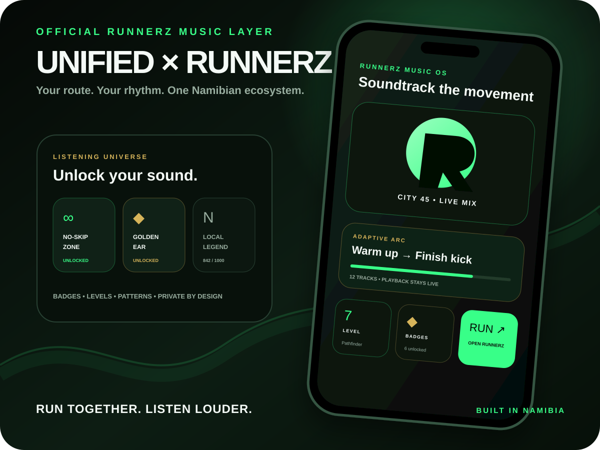

This is original ecosystem artwork for the 8.0 release. UNIFIED 9.0 below adds current physical-device evidence while the signed UNIFIED-to-Runnerz round-trip remains a separately stated integration gate.

Version 8.0 turns UNIFIED into the official music layer of the Runnerz ecosystem. The visual system now speaks the same language as the running product and its merch: **route lime** (`#39FF88`), **trail forest** (`#07120B`), **warm white** (`#F4FAF6`) and **founder gold** (`#D6B45A`). The result is one recognisable Namibian identity across listening, movement and the authored UNIFIED × Runnerz catalogue artwork.

### A music system built around how people move and listen

**Session Studio** creates five one-tap sessions from the listener's own library and on-device history: Daily Flow, Rediscover, Fresh Rotation, Deep Focus and Favorite Radio. Its results are stable for the same inputs and deliberately space repeat artists. **Track Radio** can expand any selected song into a ranked, taste-aware queue of up to 50 tracks using its artist, album, favourites and recent-listening signals. Neither system uploads listening history.

**Listening Universe** translates credible listening patterns into private progression rather than public engagement pressure. Nine persistent badges—including First Spark, Vault Keeper, Golden Ear, No-Skip Zone and Local Legend—show clear progress requirements and remain unlocked once earned. Five explainable archetypes—Pathfinder, Curator, Deep Diver, Sonic Purist and Artist Orbiter—reflect breadth, curation, listening depth, recording quality and artist focus. Levels and XP are calculated locally from plays, listening time, library depth, favourites and exploration.

### Runnerz sessions and handoff

Runnerz Mode builds private **30, 45, 60 or 90-minute** music arcs from the local collection. The selected tracks are artist-diversified and sequenced through warm-up, lock-in, tempo and finish-kick phases. Starting a session begins playback in UNIFIED, then hands only the session title, target duration and track count to an installed Runnerz production or field-test app; if neither package is available, Android falls back to the Runnerz website. Track identities and full listening history remain inside UNIFIED.

The sender and matching Runnerz receiver compile against the same explicit Android contract. A complete signed, physical-device start/run/return test remains a release gate, so this case study does not describe the cross-app link as production-complete yet.

### Rights-ready ShowTime Ambassador Channel

The **ShowTime Radio** surface is reserved for Shadrac “ShowTime” Mavungu as a Runnerz ambassador channel. It activates when local track metadata matches the declared ShowTime identity; a match does not establish approval or distribution rights. UNIFIED 8.0 does **not** bundle ambassador audio or artwork, copy protected media, promise a remote stream or imply distribution rights; editorial assets and distributable audio remain subject to explicit artist and rights-holder approval.

### Library Vault v2

The durable library now uses a checksummed, two-generation recovery design. Every new primary snapshot binds its header, timestamp, track count and body to an integrity checksum. Before replacement, the current valid snapshot is preserved as a separate atomic last-good generation. Startup validates the primary first and reads the last-good backup only when recovery is required; truncated or altered version 2 data is rejected, and version 1 snapshots remain readable for migration.

This release makes the ecosystem larger without weakening its boundary: local music, listening intelligence, achievements, run-session sequencing and Vault recovery remain on-device. Apple Music and Spotify production adapters still require registered applications, user authorisation and provider-approved infrastructure.

## UNIFIED 9.0 — Night Signal

Version 9.0 gives the official Runnerz music player its own flagship identity inside the ecosystem. The new **Signal Loop** mark joins a route-shaped U, music pulse and orbiting signal; an animated topographic field, moving beacon and spectrum-aware light now carry that identity through Home, Now Playing, navigation and the feature surfaces.

| Night Signal Home | Now Playing |
|---|---|
| 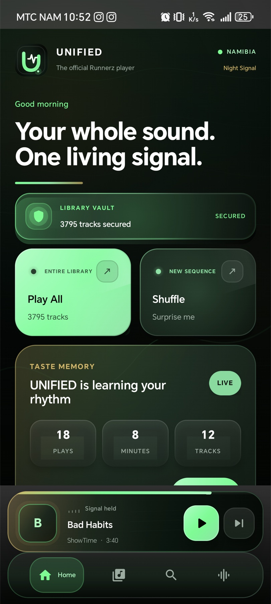 | 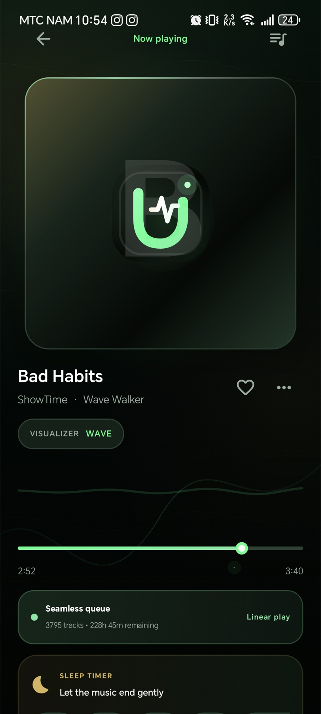 |

| Listening Universe | Runnerz + ShowTime Radio |
|---|---|
| 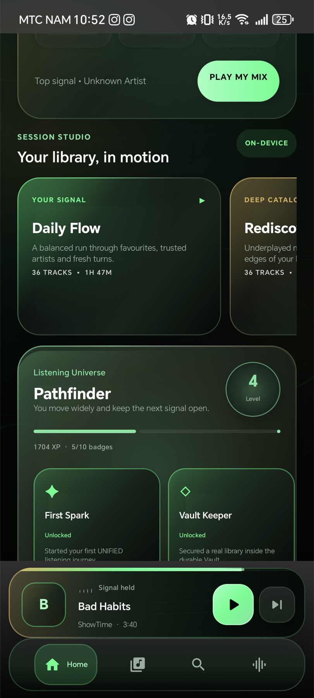 | 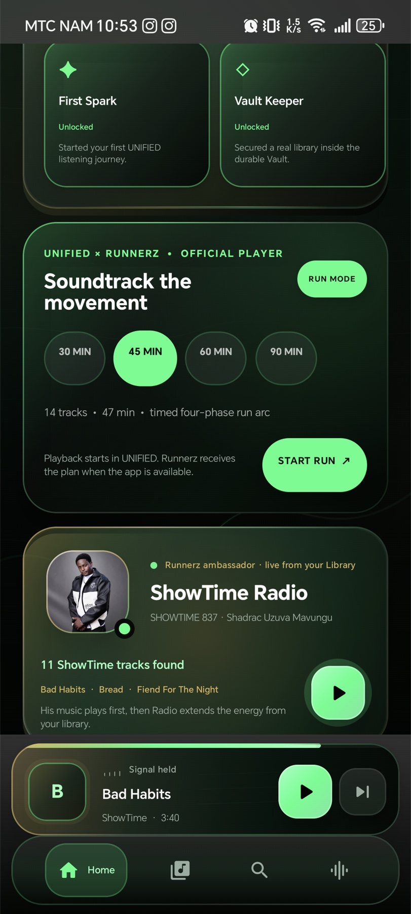 |

These are real captures from the installed `9.0-debug` build on an HONOR Android 15 handset. The in-place upgrade retained both Library Vault generations and all **3,795 local tracks**—no uninstall, destructive reset or manual rescan was required.

The release replaces flat feature glass with **living surfaces**: dimensional lower plates, refracted edges and restrained content-aware bloom. The collapsed player becomes a signature destination with designed fallback artwork, live or held signal state, a luminous progress beacon and sculpted transport controls. Missing or stale MediaStore artwork now reveals the product’s own Signal Loop treatment instead of an empty tile.

ShowTime Radio now recognizes complete artist-credit segments including `ShowTime`, `SHOWTIME 837`, full-name credits and slash-separated collaborations while rejecting unrelated names such as “Showtime Orchestra.” The release handset contains **11 matching tracks**; those real local tracks lead the generated channel before taste-aware extensions. The artist-supplied Runnerz ambassador portrait is bundled for presentation, while audio stays in the listener’s own library. Playing a matched track can unlock **837 Frequency**, the tenth durable Listening Universe badge.

## UNIFIED 10.0 — Creative Wave

Creative Wave expands Runnerz Mode from one run-shaped playlist into seven explicit movement intents: **Walk, Recovery, Easy, Steady, Tempo, Intervals and Long Run**. Each intent has its own duration, familiarity, freshness and progression priorities. Suggestions are explainable from real favourites, plays, early skips, credible listening time and track duration; UNIFIED does not invent BPM analysis that has not happened.

Seven offline **Namibia Weather Moods** let the listener frame a session as Cool Dawn, Coastal Mist, Clear Day, Desert Heat, Windy, Rain or Night Signal. They are manual creative cues, not live forecast claims. Time-aware Namibian greetings, Southern Hemisphere seasonal challenges and movement milestones bring local character into the system without collecting location.

Every launched soundtrack creates a private **Afterglow** memory. Completed memories and unlocked milestones can become 1080 × 1350 Runnerz cards rendered on-device and shared through Android without exposing content URIs or full listening history. Collection DNA adds a weighted Library Health score, Listening Universe grows to fifteen durable badges, and Audio Lab adds four Transition Bloom profiles after Media3's native gapless handoff.

## UNIFIED 11.0 — Velocity Engine

Velocity Engine makes the movement soundtrack understandable before, during and after the run. **Pace Map** reveals the actual minutes, track count and intensity allocated to Warm Up, Lock In, Tempo and Finish Kick. A transparent **Run Readiness** score reflects duration fit, phase coverage and artist variety; it is a soundtrack-readiness signal, not a health claim. **Pace Brain** uses only private Afterglow history to suggest the next movement, including a recovery arc after harder sessions.

| Velocity Home | Pace Map |
|---|---|
| 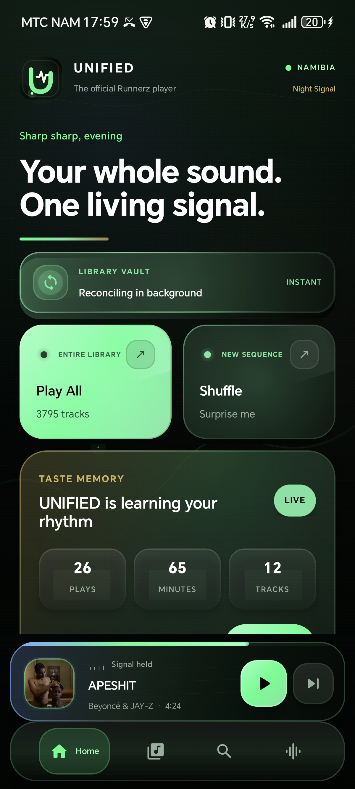 | 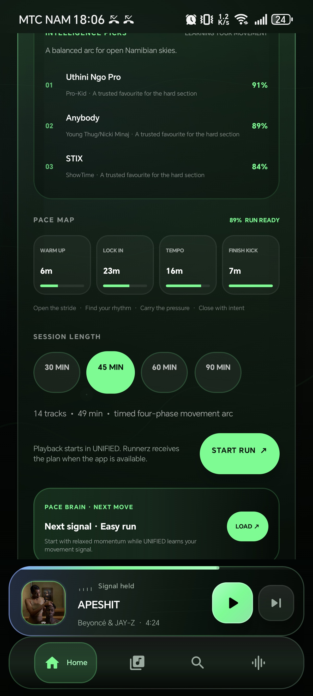 |

| Live Runnerz phase | Afterglow intelligence |
|---|---|
| 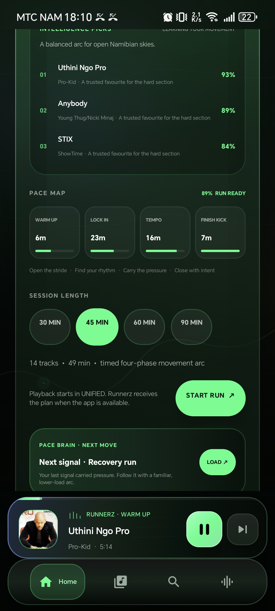 | 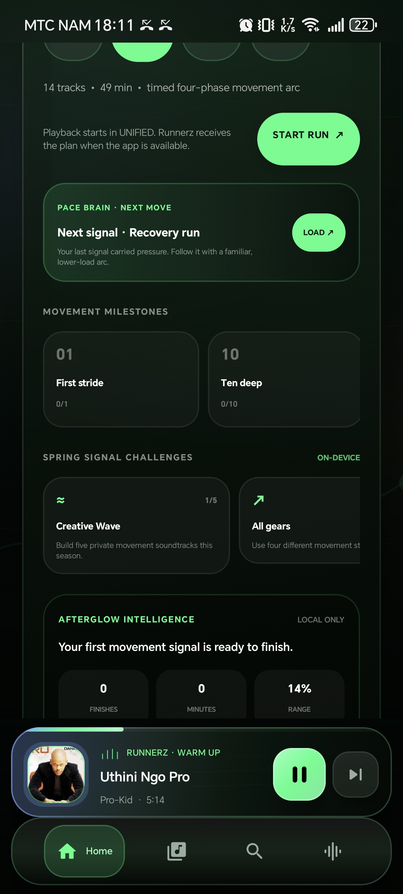 |

The minimized player follows the active phase and can restore it from the latest unfinished memory after process recreation. Afterglow summarizes completed sessions, completed minutes, movement range and the listener's signature movement. Completion returns update this state in place: the URI is consumed once, duplicates are harmless and playback is not torn down by an Activity recreation.

11.0 also targets the feel of a large real library. Search values, trigram candidates and sort variants are built lazily; exact substring queries use indexed candidates; identical MediaStore scans preserve list identity and avoid rewriting the Vault; change bursts are debounced; and intelligence plus Runnerz planning execute away from the UI dispatcher. Session planning now ranks the 3,795-track collection once per selection instead of twice.

These four images are unedited captures from the installed `11.0-debug` build on the same physical HONOR Android 15 handset. The upgrade retained both Library Vault generations and every one of the **3,795 local tracks**.

## UNIFIED 12.0 — Sonic Atlas

Sonic Atlas turns the local Library Vault into five deterministic orbits: **Your Gravity, Heartline, Lost Signals, New Light and Deep Space**. Each map is explainable from local metadata, favourites and private listening history. Five time-aware Daily Signals and four Smart Playlist Studio rules turn those orbits into playable queues without inventing genre, mood, key or BPM.

**Acoustic Truth** can decode a bounded 24-second PCM sample from the exact local file already being played. It reports measured loudness and energy, while tempo is published only when onset confidence clears the threshold; uncertain tempo remains visibly `OPEN`. Audio bytes are neither uploaded nor written by UNIFIED. The cached Soundprint contains a track identifier and measurements, not title, artist, album or file URI.

Listening DNA summarizes credible minutes, explored tracks and artists, replay behaviour, held-signal percentage and rediscovery candidates. Its optional 1080 × 1350 share card contains aggregate statistics only. Listening Universe grows to twenty durable badges.

## UNIFIED 13.0 — Flow State

Flow State turns **intent plus available time** into an explainable listening arc. Ascend, Steady Current, Deep Focus, Afterglow and Unknown Territory rank the listener's own collection using favourites, credible plays, early skips, freshness, duration and discovery history. A 20, 40, 60 or 90-minute selection becomes an artist-diversified **Ignition, Cruise, Lift and Arrival** sequence.

Known Soundprints can shape a genuine energy contour without excluding the rest of the library. Unmapped tracks stay visibly `OPEN`, and Soundprint Lab analyses at most eight user-requested queued files per pass. Flow and Runnerz stage context remain visible through Home, Now Playing and the signature minimized player. Five acoustic-progression badges bring Listening Universe to twenty-five unlockables.

| Launch identity | Library Vault + Home |
|---|---|
| 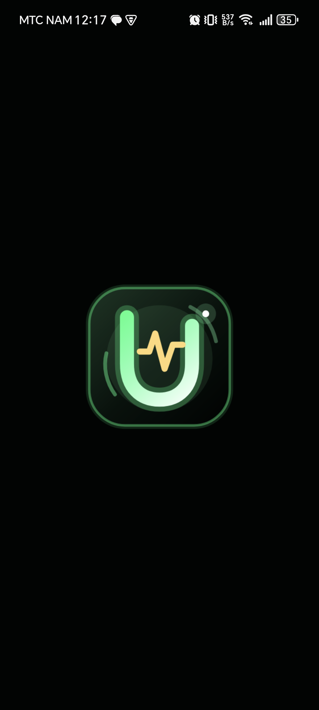 | 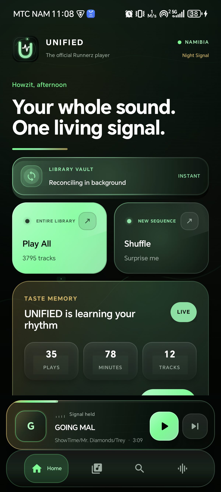 |

| Flow State | Now Playing |
|---|---|
| 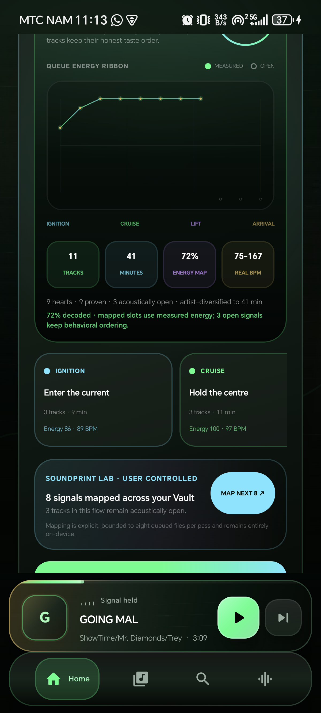 | 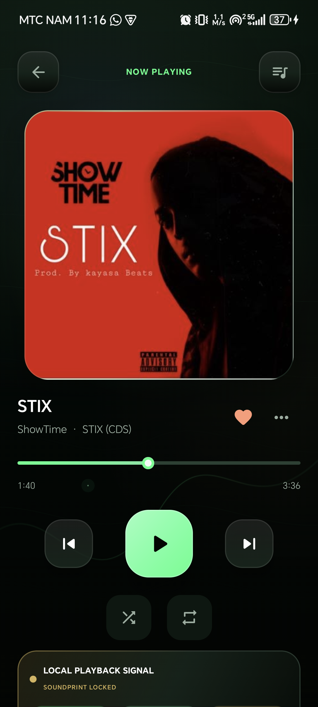 |

These are unedited captures from the installed `13.0-debug` build on the Android 15 release handset. The in-place upgrade retained all **3,795 tracks** in Library Vault.

## UNIFIED 14.0 — Signal Journal

Signal Journal adds a private daily ritual without turning listening into public surveillance. Credible track starts, played-time intervals, skips and explicitly launched Runnerz soundtracks are reduced into bounded daily records stored on-device. The journal keeps at most 120 days and 64 unique track identifiers per day; it does not add titles, artists, albums, file locations or playback positions to that record.

Four missions advance only from real evidence: play three different tracks, listen for twenty credible minutes, move through three known artists and start one Runnerz soundtrack. A seven-day pulse exposes active days, minutes, track breadth, artist breadth, current streak, best streak and perfect days. Five new badges—**Journal Spark, Three-Day Current, Seven-Day Signal, Mission Control and Momentum 30**—bring Listening Universe to thirty durable unlockables.

The on-device Signal Receipt contains only aggregate pulse, streak, minute, track and artist counts. It never includes a track identifier, title, artist, album or local URI.

| Signal Journal | Daily missions + Share Pulse |
|---|---|
| 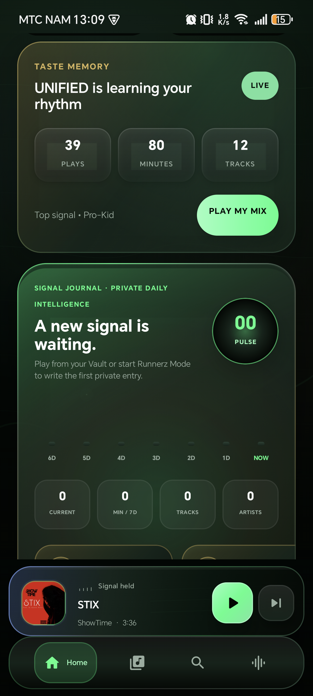 | 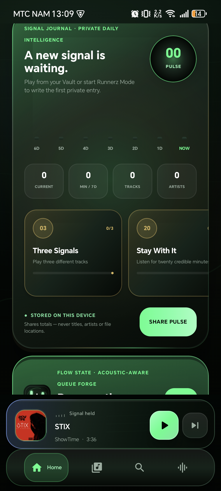 |

These are unedited captures from the installed `14.0-debug` build. The in-place upgrade preserved both Vault generations and all **3,795 tracks**. After one real playback observation and a forced process restart, the Journal restored one current day, one track, one known artist and the correct mission progress. The external Android share sheet rendered a verified 1080 × 1350 Signal Receipt.

## My role

**Freeman Ipumbu — Product designer and software engineer**

I shaped the product direction, interaction and visual systems, shared domain model, Android playback runtime, provider-neutral catalog foundation and Kotlin Multiplatform architecture.

## The problem

Music collections become fragmented across devices, folders and services. Playback controls, queues, favourites, playlists and audio tuning often feel like separate tools rather than one understandable system.

UNIFIED explores a calmer local-first model:

```text
DISCOVER → ORGANISE → QUEUE → PLAY → SHAPE THE SOUND → RETURN
```

Local ownership and honest playback state come first. Streaming providers enter through explicit capability boundaries instead of compromising offline reliability or pretending protected provider audio can be treated like local media.

## Product response

- Android MediaStore discovery for large on-device libraries.
- Atomic Library Vault snapshots with instant restoration and empty-scan protection.
- Checksummed two-generation Vault recovery with legacy-snapshot compatibility.
- Automatic MediaStore change observation and background reconciliation.
- Collection DNA analysis, format distribution, artwork coverage, metadata-gap and duplicate-candidate reporting.
- Six live count-aware library filters that compose with sorting and playback.
- Media3/ExoPlayer foreground playback with a preloaded native queue, MediaSession, notification and lock-screen controls.
- Durable current-track, position, shuffle, repeat and exact queue-order restoration using stable media identities.
- Position-preserving queue editing, service-owned shuffle/repeat, native transition synchronisation, seeking and automatic completion handling.
- Remaining queue-time awareness and a countdown/end-of-track sleep timer.
- Persistent favourites and playlists with grouped artist and album views.
- Durable on-device Taste Memory with play, early-skip and listened-time signals.
- Explainable adaptive Smart Mix plus Recently Played and Most Played surfaces.
- Session Studio with five local, history-aware listening modes.
- Track Radio generated from a selected song and local taste signals.
- Listening Universe levels, XP, five archetypes and thirty persistent unlockable badges, including 837 Frequency and five Signal Journal milestones.
- Five-orbit Sonic Atlas, Daily Signals, Smart Playlist Studio and metadata-minimizing Listening DNA cards.
- Confidence-gated local Soundprints plus Flow State's five intents, four time targets and four-stage queues.
- A bounded private Signal Journal with four evidence-based missions, seven-day pulse and aggregate-only Signal Receipts.
- Seven activity-aware Runnerz music arcs with Pace Map, Run Readiness, Pace Brain and an explicit, minimal Android handoff.
- Private Afterglow memories, movement milestones, seasonal challenges and on-device share cards.
- Complete-credit ShowTime Radio discovery with local-track-first queueing and a supplied ambassador portrait; audio distribution remains approval-gated.
- Equaliser, bass, loudness and dynamics controls through Audio Lab.
- Audio-reactive spectrum and waveform visualisation.
- A Compose interface spanning Home, Library, Search, Playlists, Now Playing and Audio Lab.
- Provider-neutral Apple Music/Spotify gateway and ISRC-first cross-catalog merger; production adapters still require registered applications and credentials.

## Design approach

1. **Observe** — identify where local players fragment discovery, playback and organisation.
2. **Frame** — treat the queue and current track as one durable product state.
3. **Design** — build hierarchy around artwork, readable type, consistent controls and restrained motion.
4. **Connect the ecosystem** — use Runnerz colour, movement language and explicit app boundaries so the player feels native to the same product family.
5. **Localise the identity** — derive warmth and atmosphere from Namibia without reducing the interface to literal motifs.
6. **Build** — share domain and interface logic with Kotlin Multiplatform while keeping platform playback responsibilities explicit.
7. **Evaluate** — verify permissions, persistence, background playback and system media controls on physical hardware.
8. **Harden** — make automated tests, lint and reproducible builds release gates.

## Engineering overview

- Kotlin Multiplatform
- Jetpack Compose and Compose Multiplatform foundations
- Android MediaStore library discovery
- AndroidX Media3 / ExoPlayer playback service
- MediaSession, foreground notification and system transport controls
- Native equaliser, dynamics, bass and loudness processing
- Shared queue, playlist, provider, library and player domain models
- Preference-backed player, playlist, favourite, Audio Lab and listening-history state
- Android SDK 36 with minimum SDK 26
- GitHub Actions quality gate for tests, lint and debug APK assembly

## Verified evidence

- The complete UNIFIED 14.0 Android gate passed on 25 September 2026: shared logic and UI tests, app unit-test task, lint, debug APK assembly and unsigned release assembly.
- All 60 executed shared test cases passed with zero failures, errors or skips; Android lint completed successfully.
- Coverage now includes collection analysis, smart filters, reconciliation, snapshot recovery, indexed search, queue preloading, Velocity planning, Pace Brain, Sonic Atlas, Flow State, Signal Journal codec fidelity, real daily evidence, privacy-safe share output and all five Journal badge thresholds.
- Shared iOS simulator logic compiles successfully; iOS product parity is not claimed.
- Versions through 14.0 were installed and visually inspected on a physical Android 15 release handset.
- The 14.0 in-place upgrade retained both 3,795-track Vault generations with an unchanged primary checksum; version code 15, cold launch, playback-driven Journal persistence and the real external share sheet were directly verified.
- On that device, foreground/background playback, advancing position and system media metadata were verified through the active Media3 session.
- The 11.0 debug APK was installed in place as version code 12. Both Vault files retained 3,796 lines each—the version header plus 3,795 tracks.
- The browser handoff produced a real 14-track, 49-minute Tempo session from a 45-minute request. Its exact issued completion URI was returned and replayed twice; Android retained one top Activity and showed no recreation loop or flashing.

## Current boundary

Android is the production-focused implementation. The iOS target remains an early shell; native playback and shared production UI are not presented as complete.

Apple Music and Spotify production connections are not claimed. The provider-neutral gateway, capability model and catalog merger exist, but real adapters require registered applications, approved redirect URIs, signing identities and secure token infrastructure.

The UNIFIED-to-Runnerz sender and return contract are implemented, and the exact browser-fallback round trip is physically verified. A final signed Runnerz-app round trip is still required before describing the native cross-app bridge as production-complete. ShowTime Radio is a metadata-matched local activation surface, not proof of media rights, a bundled catalogue or a streaming service.

## Next milestones

- Measured true overlapping crossfade, only if device testing shows it improves on native seamless playback and Transition Bloom.
- Room-backed incremental indexing only if physical performance measurements justify the added database complexity.
- Feature-owned navigation and state modules.
- Signed physical-device validation of the complete UNIFIED → Runnerz → UNIFIED session loop.
- Ambassador editorial and media publication only after explicit rights approval.
- Native iOS playback and remote-command integration.

## Repository boundary

The private repository contains the working implementation. This public case study intentionally excludes source code, local media, generated applications, device identifiers, environment files, credentials and internal recovery material.

---

© 2026 Freeman Ipumbu. Shared for portfolio evaluation; no licence is granted to reproduce the product or implementation.
